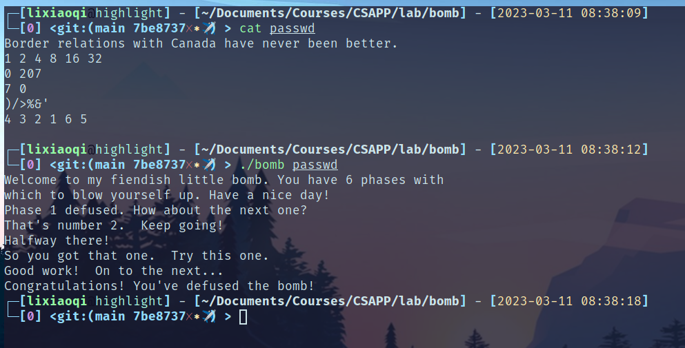
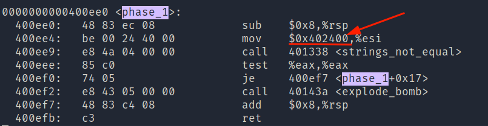
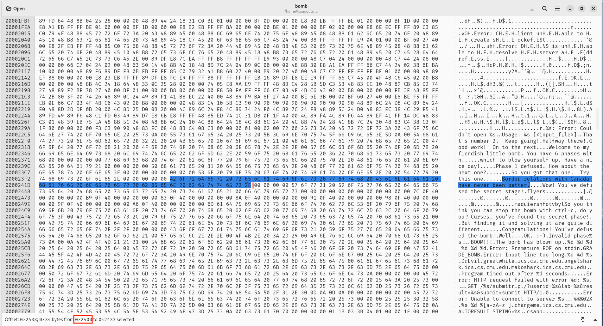

# bomblab报告

## 快览

这个实验需要我们根据给出的可执行文件+主函数源代码，确定6个字符串。

实验完成截图：



## 实验详解

使用工具：

- objdump，生成bomb的反汇编

- ghex，可以直接以十六进制读取文件，左边十六进制右边ascii，可以直接跳转到任意比特，非常方便。

- gdb逐指令调试

### phase1

红色箭头标识出，进行比较的另一个串首地址在`0x402400`，Linux 系统默认情况下将可执行文件的 .text 节映射到虚拟地址 `0x400000` 开始的位置，所以在文件中的实际偏移是`0x2400`



在ghex中跳转至相应地址就可以找到对应字符串



### phase2

以下是`phase_2`的反汇编。

分析得到：

- 6个数字：`400f05`处的函数调用`read_six_numbers`

- 第一个数字是1：`400f0a`处的比较

- 后一个数字是前一个数字2倍：`400f17`到`400f2c`处的循环

而阅读函数`read_six_numbers`发现，字符到数字的转换是使用stl函数`sscanf`完成的，所以数字中间用空白字符(空格、tab等)隔开均可。

```
0000000000400efc <phase_2>:
  400efc:    55                       push   %rbp
  400efd:    53                       push   %rbx
  400efe:    48 83 ec 28              sub    $0x28,%rsp
  400f02:    48 89 e6                 mov    %rsp,%rsi
  400f05:    e8 52 05 00 00           call   40145c <read_six_numbers>
  400f0a:    83 3c 24 01              cmpl   $0x1,(%rsp)
  400f0e:    74 20                    je     400f30 <phase_2+0x34>
  400f10:    e8 25 05 00 00           call   40143a <explode_bomb>
  400f15:    eb 19                    jmp    400f30 <phase_2+0x34>
  400f17:    8b 43 fc                 mov    -0x4(%rbx),%eax
  400f1a:    01 c0                    add    %eax,%eax
  400f1c:    39 03                    cmp    %eax,(%rbx)
  400f1e:    74 05                    je     400f25 <phase_2+0x29>
  400f20:    e8 15 05 00 00           call   40143a <explode_bomb>
  400f25:    48 83 c3 04              add    $0x4,%rbx
  400f29:    48 39 eb                 cmp    %rbp,%rbx
  400f2c:    75 e9                    jne    400f17 <phase_2+0x1b>
  400f2e:    eb 0c                    jmp    400f3c <phase_2+0x40>
  400f30:    48 8d 5c 24 04           lea    0x4(%rsp),%rbx
  400f35:    48 8d 6c 24 18           lea    0x18(%rsp),%rbp
  400f3a:    eb db                    jmp    400f17 <phase_2+0x1b>
  400f3c:    48 83 c4 28              add    $0x28,%rsp
  400f40:    5b                       pop    %rbx
  400f41:    5d                       pop    %rbp
  400f42:    c3                       ret
```

### phase3

```
0000000000400f43 <phase_3>:
  400f43:    48 83 ec 18              sub    $0x18,%rsp
  400f47:    48 8d 4c 24 0c           lea    0xc(%rsp),%rcx
  400f4c:    48 8d 54 24 08           lea    0x8(%rsp),%rdx
  400f51:    be cf 25 40 00           mov    $0x4025cf,%esi
  400f56:    b8 00 00 00 00           mov    $0x0,%eax
  400f5b:    e8 90 fc ff ff           call   400bf0 <__isoc99_sscanf@plt>
  400f60:    83 f8 01                 cmp    $0x1,%eax
  400f63:    7f 05                    jg     400f6a <phase_3+0x27>
  400f65:    e8 d0 04 00 00           call   40143a <explode_bomb>
  400f6a:    83 7c 24 08 07           cmpl   $0x7,0x8(%rsp)
  400f6f:    77 3c                    ja     400fad <phase_3+0x6a>
  400f71:    8b 44 24 08              mov    0x8(%rsp),%eax
  400f75:    ff 24 c5 70 24 40 00     jmp    *0x402470(,%rax,8)
  400f7c:    b8 cf 00 00 00           mov    $0xcf,%eax
  400f81:    eb 3b                    jmp    400fbe <phase_3+0x7b>
  400f83:    b8 c3 02 00 00           mov    $0x2c3,%eax
  400f88:    eb 34                    jmp    400fbe <phase_3+0x7b>
  400f8a:    b8 00 01 00 00           mov    $0x100,%eax
  400f8f:    eb 2d                    jmp    400fbe <phase_3+0x7b>
  400f91:    b8 85 01 00 00           mov    $0x185,%eax
  400f96:    eb 26                    jmp    400fbe <phase_3+0x7b>
  400f98:    b8 ce 00 00 00           mov    $0xce,%eax
  400f9d:    eb 1f                    jmp    400fbe <phase_3+0x7b>
  400f9f:    b8 aa 02 00 00           mov    $0x2aa,%eax
  400fa4:    eb 18                    jmp    400fbe <phase_3+0x7b>
  400fa6:    b8 47 01 00 00           mov    $0x147,%eax
  400fab:    eb 11                    jmp    400fbe <phase_3+0x7b>
  400fad:    e8 88 04 00 00           call   40143a <explode_bomb>
  400fb2:    b8 00 00 00 00           mov    $0x0,%eax
  400fb7:    eb 05                    jmp    400fbe <phase_3+0x7b>
  400fb9:    b8 37 01 00 00           mov    $0x137,%eax
  400fbe:    3b 44 24 0c              cmp    0xc(%rsp),%eax
  400fc2:    74 05                    je     400fc9 <phase_3+0x86>
  400fc4:    e8 71 04 00 00           call   40143a <explode_bomb>
  400fc9:    48 83 c4 18              add    $0x18,%rsp
  400fcd:    c3                       ret
```

还原出sscanf的函数调用：`sscanf(input, "%d "%d", 0x8(%rsp), 0xc(%rsp))`

第二个参数是因为内存`0x4025cf`保存的字符串是`"%d %d"`，所以输入字符串应该是两个数字，两个数字记为a、b。

- 根据位置`400f6a`的比较指令`cmpl $0x7,0x8(%rsp)`及之后的跳转：a<=7

- 根据`400f75`处的分支指令，程序会根据a的值为`%eax`赋值，最后将`$eax`和b比较，相等才能通过，由此a、b是一一对应的。
  
  通过gdb调试，将所有8种情况列出：
  
  | a   | b   |
  | --- | --- |
  | 0   | 207 |
  | 1   | 311 |
  | 2   | 707 |
  | 3   | 256 |
  | 4   | 389 |
  | 5   | 206 |
  | 6   | 682 |
  | 7   | 327 |

### phase4

```
000000000040100c <phase_4>:
  40100c:    48 83 ec 18              sub    $0x18,%rsp
  401010:    48 8d 4c 24 0c           lea    0xc(%rsp),%rcx
  401015:    48 8d 54 24 08           lea    0x8(%rsp),%rdx
  40101a:    be cf 25 40 00           mov    $0x4025cf,%esi
  40101f:    b8 00 00 00 00           mov    $0x0,%eax
  401024:    e8 c7 fb ff ff           call   400bf0 <__isoc99_sscanf@plt>
  401029:    83 f8 02                 cmp    $0x2,%eax
  40102c:    75 07                    jne    401035 <phase_4+0x29>
  40102e:    83 7c 24 08 0e           cmpl   $0xe,0x8(%rsp)
  401033:    76 05                    jbe    40103a <phase_4+0x2e>
  401035:    e8 00 04 00 00           call   40143a <explode_bomb>
  40103a:    ba 0e 00 00 00           mov    $0xe,%edx
  40103f:    be 00 00 00 00           mov    $0x0,%esi
  401044:    8b 7c 24 08              mov    0x8(%rsp),%edi
  401048:    e8 81 ff ff ff           call   400fce <func4>
  40104d:    85 c0                    test   %eax,%eax
  40104f:    75 07                    jne    401058 <phase_4+0x4c>
  401051:    83 7c 24 0c 00           cmpl   $0x0,0xc(%rsp)
  401056:    74 05                    je     40105d <phase_4+0x51>
  401058:    e8 dd 03 00 00           call   40143a <explode_bomb>
  40105d:    48 83 c4 18              add    $0x18,%rsp
  401061:    c3                       ret
```

函数`phase_4`同样是从输入串中获取两个数字，分别记作a、b

- 结合`401051`处的比较指令和后续分支，判断b=0

- 结合`40102e`处的比较指令和后续分支，判断a<=14

- 调用func4：`func4(a,0,14)`，需要满足其返回值为0(`40104d`和`40104f`两条指令)，func4是一个递归函数，其伪代码如下：
  
  ```python
  def f(a, b, c):
      if c < b:
          t = c - b + 1
      else:
          t = c - b
      t //= 2
      ecx = t + b
      if a <= ecx:
          t = 0
          if a < ecx:
              b = ecx + 1
              t = f(a, b, c)
              t = 2 * t + 1
      else:
          c = t + b - 1
          t = f(a, b, c)
          t *= 2
      return t
  ```
  
  看了很久也没看懂这个是干啥的，后来突然开窍，可以直接取特值。
  
  第一次调用，b=0，c=14，算出来t=ecx=7
  
  只需要a=7，就可以在if下边给t赋0，然后返回0。

### phase5

```
0000000000401062 <phase_5>:
  401062:    53                       push   %rbx
  401063:    48 83 ec 20              sub    $0x20,%rsp
  401067:    48 89 fb                 mov    %rdi,%rbx
  40106a:    64 48 8b 04 25 28 00     mov    %fs:0x28,%rax
  401071:    00 00 
  401073:    48 89 44 24 18           mov    %rax,0x18(%rsp)
  401078:    31 c0                    xor    %eax,%eax
  40107a:    e8 9c 02 00 00           call   40131b <string_length>
  40107f:    83 f8 06                 cmp    $0x6,%eax
  401082:    74 4e                    je     4010d2 <phase_5+0x70>
  401084:    e8 b1 03 00 00           call   40143a <explode_bomb>
  401089:    eb 47                    jmp    4010d2 <phase_5+0x70>
  40108b:    0f b6 0c 03              movzbl (%rbx,%rax,1),%ecx
  40108f:    88 0c 24                 mov    %cl,(%rsp)
  401092:    48 8b 14 24              mov    (%rsp),%rdx
  401096:    83 e2 0f                 and    $0xf,%edx
  401099:    0f b6 92 b0 24 40 00     movzbl 0x4024b0(%rdx),%edx
  4010a0:    88 54 04 10              mov    %dl,0x10(%rsp,%rax,1)
  4010a4:    48 83 c0 01              add    $0x1,%rax
  4010a8:    48 83 f8 06              cmp    $0x6,%rax
  4010ac:    75 dd                    jne    40108b <phase_5+0x29>
  4010ae:    c6 44 24 16 00           movb   $0x0,0x16(%rsp)
  4010b3:    be 5e 24 40 00           mov    $0x40245e,%esi
  4010b8:    48 8d 7c 24 10           lea    0x10(%rsp),%rdi
  4010bd:    e8 76 02 00 00           call   401338 <strings_not_equal>
  4010c2:    85 c0                    test   %eax,%eax
  4010c4:    74 13                    je     4010d9 <phase_5+0x77>
  4010c6:    e8 6f 03 00 00           call   40143a <explode_bomb>
  4010cb:    0f 1f 44 00 00           nopl   0x0(%rax,%rax,1)
  4010d0:    eb 07                    jmp    4010d9 <phase_5+0x77>
  4010d2:    b8 00 00 00 00           mov    $0x0,%eax
  4010d7:    eb b2                    jmp    40108b <phase_5+0x29>
  4010d9:    48 8b 44 24 18           mov    0x18(%rsp),%rax
  4010de:    64 48 33 04 25 28 00     xor    %fs:0x28,%rax
  4010e5:    00 00 
  4010e7:    74 05                    je     4010ee <phase_5+0x8c>
  4010e9:    e8 42 fa ff ff           call   400b30 <__stack_chk_fail@plt>
  4010ee:    48 83 c4 20              add    $0x20,%rsp
  4010f2:    5b                       pop    %rbx
  4010f3:    c3                       ret
```

- 内存地址`0x40245e`处存储的字符串是`flyers`

- 内存地址`0x4024b0`开始的16个字符是：`maduiersnfotvbyl`
  
  flyers中6个字符对应的偏移量分别是：9, 15, 14, 5, 6, 7

- 根据汇编`40107f`处的指令，程序读入6个字符

- 根据`40108b`\~`4010ac`处的指令，程序根据每个输入字符的低4位做索引，在上述内存地址`0x4024b0`处读取字符存入栈中，根据`4010bd`处的`strings_not_equal`函数调用，知道存入栈中的需要是字符串`flyers`

- 综合以上，输入字符的高4位并无影响，低4位分别是：9, 15, 14, 5, 6, 7

```
      ) 9 I Y i y   © ¹ É Ù é
  / ? O _ o    ¯ ¿ Ï ß ï
  . > N ^ n ~   ® ¾ Î Þ î
  % 5 E U e u   ¥ µ Å Õ å
  & 6 F V f v   ¦ ¶ Æ Ö æ
  ' 7 G W g w   § · Ç × ç
```

以上打印出了所有可能的结果，每一行的字符的低4位满足上述规则，为了满足测试，只需要在每一列中任选一个输入即可，如`)/>%&'`或者`IONEFG`等等

### phase6

```
00000000004010f4 <phase_6>:
  4010f4:    41 56                    push   %r14
  4010f6:    41 55                    push   %r13
  4010f8:    41 54                    push   %r12
  4010fa:    55                       push   %rbp
  4010fb:    53                       push   %rbx
  4010fc:    48 83 ec 50              sub    $0x50,%rsp
// read_six_numbers, 确定读进的是精确的6个数字
  401100:    49 89 e5                 mov    %rsp,%r13
  401103:    48 89 e6                 mov    %rsp,%rsi
  401106:    e8 51 03 00 00           call   40145c <read_six_numbers>
  40110b:    49 89 e6                 mov    %rsp,%r14
  40110e:    41 bc 00 00 00 00        mov    $0x0,%r12d
// 两层循环：每个数字都<=0，6个数字各不相同
// 外层
  401114:    4c 89 ed                 mov    %r13,%rbp
  401117:    41 8b 45 00              mov    0x0(%r13),%eax
  40111b:    83 e8 01                 sub    $0x1,%eax
  40111e:    83 f8 05                 cmp    $0x5,%eax
  401121:    76 05                    jbe    401128 <phase_6+0x34>
  401123:    e8 12 03 00 00           call   40143a <explode_bomb>
  401128:    41 83 c4 01              add    $0x1,%r12d
  40112c:    41 83 fc 06              cmp    $0x6,%r12d
  401130:    74 21                    je     401153 <phase_6+0x5f>
  401132:    44 89 e3                 mov    %r12d,%ebx
// 内层
  401135:    48 63 c3                 movslq %ebx,%rax
  401138:    8b 04 84                 mov    (%rsp,%rax,4),%eax
  40113b:    39 45 00                 cmp    %eax,0x0(%rbp)
  40113e:    75 05                    jne    401145 <phase_6+0x51> // 和栈顶不相等
  401140:    e8 f5 02 00 00           call   40143a <explode_bomb>
  401145:    83 c3 01                 add    $0x1,%ebx
  401148:    83 fb 05                 cmp    $0x5,%ebx
  40114b:    7e e8                    jle    401135 <phase_6+0x41>
  40114d:    49 83 c5 04              add    $0x4,%r13
  401151:    eb c1                    jmp    401114 <phase_6+0x20>
// ...
```

这个实在是太长了，看不完。但还是得硬着头皮看。

不过天无绝人之路，发现在`401114`\~`401151`处是一个两层的循环，这两层循环保证了：

- 6个数字，每个都不能大于6

- 6个数字各不相同

还往下看吗？当然不！0\~6共7个数，全排列的数量只有5040个，直接暴力求解(反正这个不扣分)。

用下边的脚本输出解：

```python
import subprocess

SUM = 6

EXEC = "./bomb"
ARGS = "passwd"

CMD = [EXEC, ARGS]

def check(lis: list):
    lis = [str(k) for k in lis]
    _in = " ".join(lis) + "\n"

    res = subprocess.run(CMD, input=_in.encode("utf8"), capture_output=True)
    if res.returncode == 0:
        print(_in)


def check_helper(lis):
    if len(lis) == SUM:
        #  print(lis)
        check(lis);
        return
    for i in range(SUM + 1):
        if i not in lis:
            lis.append(i)
            check_helper(lis)
            lis.pop()

if __name__ == '__main__':
    check_helper([])
```

结果输出：4 3 2 1 6 5
