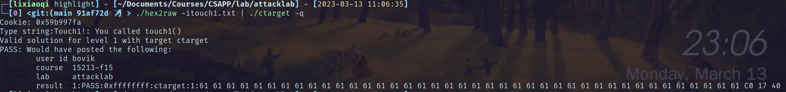
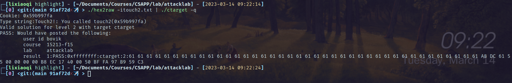
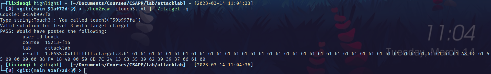
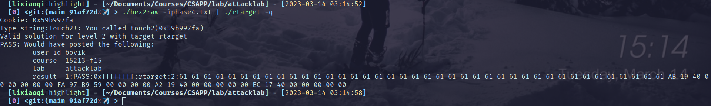
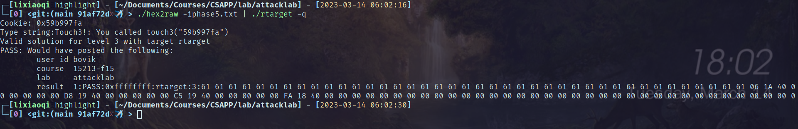
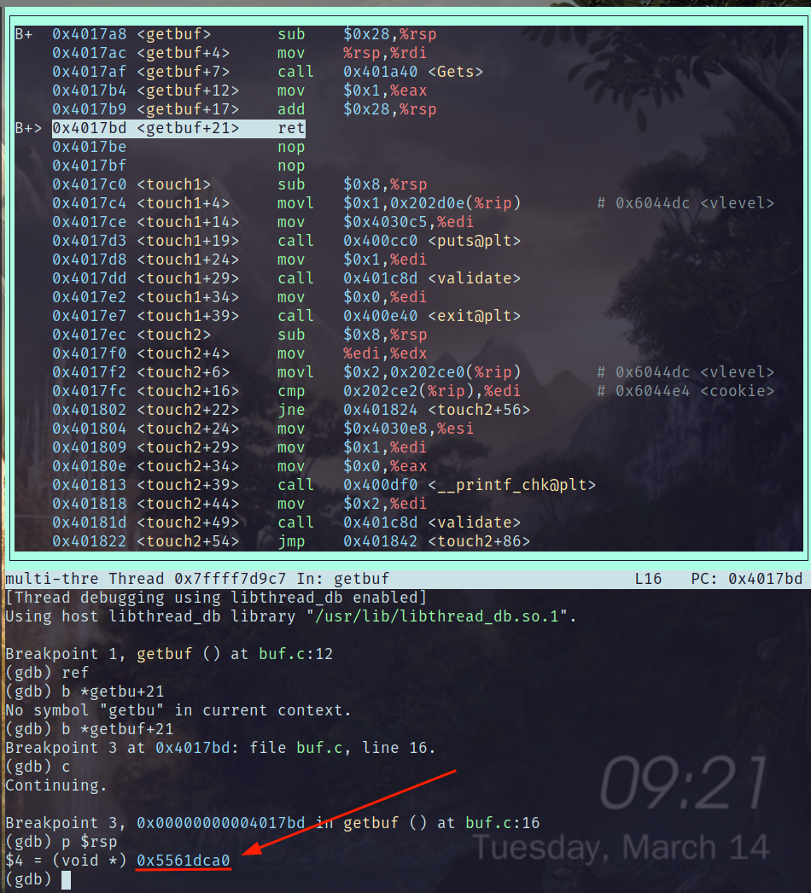
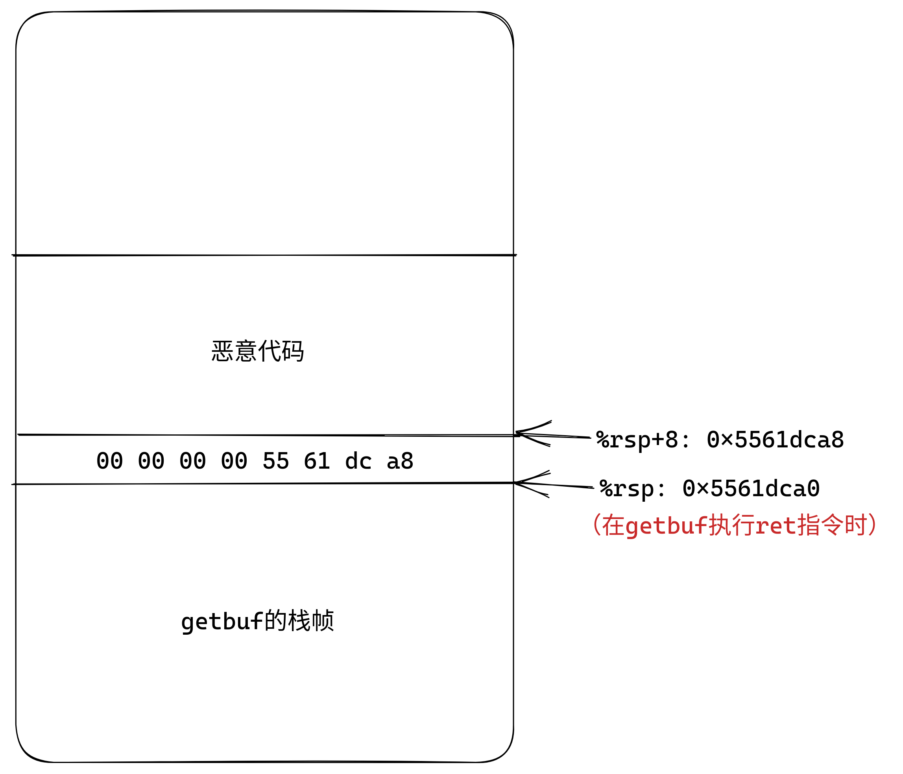
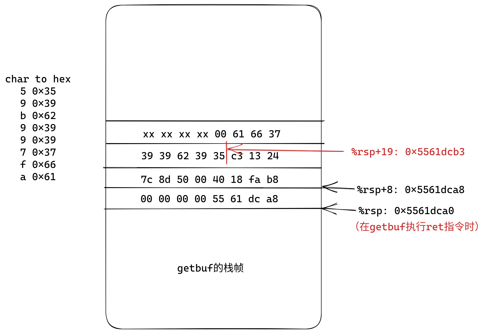
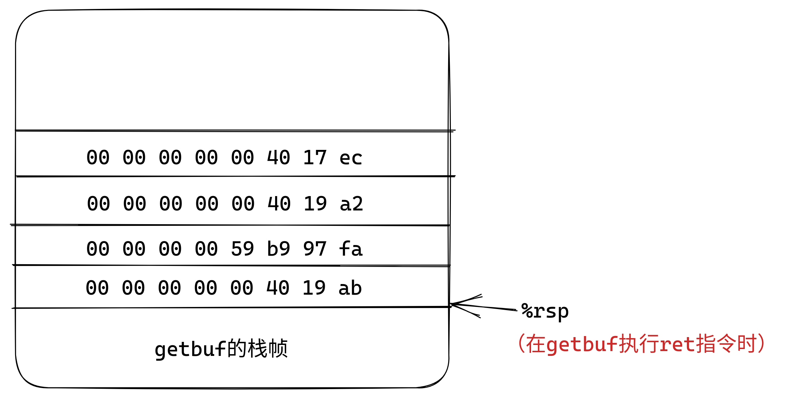
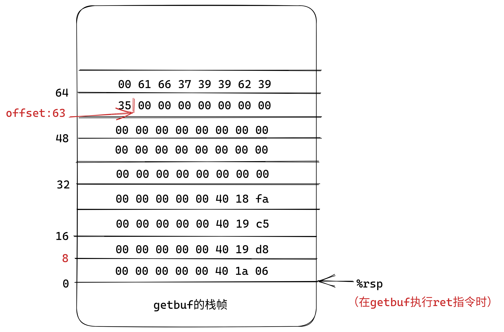

# attacklab报告

## 快览

- phase1
  
  

- phase2
  
  

- phase3
  
  

- phase4
  
  

- phase5
  
  

## 详解

### phase1

需要借助缓冲区溢出修改返回地址，使`getbuf`结束时返回到错误的地址，调用函数`touch1`。

首先函数`getbuf`的反汇编代码如下：

```
00000000004017a8 <getbuf>:
  4017a8:    48 83 ec 28              sub    $0x28,%rsp
  4017ac:    48 89 e7                 mov    %rsp,%rdi
  4017af:    e8 8c 02 00 00           call   401a40 <Gets>
  4017b4:    b8 01 00 00 00           mov    $0x1,%eax
  4017b9:    48 83 c4 28              add    $0x28,%rsp
  4017bd:    c3                       ret
  4017be:    90                       nop
  4017bf:    90                       nop
```

可见字符数组的空间大小是`0x28`即40字节，没有`rbp`的压栈，所以写入40个字符之后，再写入的都是溢出字符。而`touch1`的地址是`0x4017c0`，由于小字节序的缘故，需要逆序写入，即依次写入`c0`、`17`、`40`。

所以前边输入任意40个字符(换行符除外)，然后写入`c0`、`17`、`40`即可。

### phase2

这个小题需要重定向程序到`touch2`，和上题不同的是，`touch2`需要输入参数为自己的cookie，这就需要执行参数赋值的代码。所以流程是：将程序重定向到溢出的缓冲区，执行参数赋值和调用代码。

首先需要确定重定向的地址(恶意代码的起始地址)。这个地址与栈帧有关，因为代码注入在缓冲区(溢出)。利用gdb读出函数`getbuf`结束时的`%rsp`，如下：



这是释放函数`getbuf`空间之后的`%rsp`，溢出的内容就是从这里开始的。此时PC所在的`ret`指令会访问`%rsp`指向的内存，将其作为返回地址返回。所以在内存中，从当前`%rsp`(0x5561dca0)开始，溢出的内容应该依次是：栈上的返回地址(即恶意代码的地址)，恶意代码。

对于恶意代码，需要完成的任务是：传递参数、函数调用。使用如下代码：

```
   0:    b8 ec 17 40 00           mov    $0x4017ec,%eax
   5:    50                       push   %rax
   6:    bf fa 97 b9 59           mov    $0x59b997fa,%edi
   b:    c3                       ret
```

其中需要使用`push`指令，将`%eax`向下移动同时压入`touch2`的地址，`%edi`的值`0x59b997fa`是我的cookie。

总结，栈的布局如下：



### phase3

和phase2类似，本次参数类型是字符串，这只需要将需要的字符串写入栈中，将字符串的起始地址传递给`%edi`即可。

有一个小弯，cookie是`0x59b997fa`，需要匹配的字符串是`59b997fa`，这是8个字节，'5'在低地址处，'a'在高地址处，还要考虑终止符。

注入的代码部分如下：

```
   0:    b8 fa 18 40 00           mov    $0x4018fa,%eax
   5:    50                       push   %rax
   6:    8d 7c 24 13              lea    0x13(%rsp),%edi
   a:    c3                       ret
```

具体的栈布局如下：



### phase4

本小题要求利用ROP攻击，使用程序`rtarget`重现phase2。根据分析，决定栈中的布局是：



- `getbuf`的ret会转移到`0x4019ab`处执行，对应语句`popq %rax`，使寄存器`%rax`内部保存cookie的值

- 紧接着的ret会转移到`0x4019a2`，执行语句`movq %rax %rdi`，完成参数赋值

- 然后ret就转移到地址`0x4017ec`，对应`touch2`的地址

### phase5

利用ROP攻击技术重现phase3。

这里的难点在于如何获取字符串的地址：字符串是溢出字符串的一部分，其地址也在栈上，而栈的地址一定要获取`%rsp`。gadget farm中只能获得将`%rsp`转移到`%rax`内的指令，还有`%rax`的值转移到`%rdi`中，但是这样有一个问题，两次转移中间一定夹杂一个ret指令，要求ret时，`%rsp`指向的栈空间保存指令地址，而**不能是cookie字符串**。

直到发现了`add_xy`中的trick：

```
00000000004019d6 <add_xy>:
  4019d6:    48 8d 04 37              lea    (%rdi,%rsi,1),%rax
  4019da:    c3                       ret
```

这里`04 37`对应指令`add $0x37,%al`，也就是给`%rax`的低8位加55。

这样就可以满足获取`%rsp`时，`%rsp`指向的并不是字符串。同时有一个固定间隔55。

所以首先获取`%rsp`的值给`%rax`，此时就是对应下图偏移量为8的位置，后续会将`%rax`加55，指向cookie字符串，这个对应偏移量63，在下图中有标出，从那里开始写入cookie字符串。

几个地址的描述如下：

- `0x401a06`：`movq %rsp, %rax`

- `0x4019d8`：`add $0x37, %al`

- `0x4019c5`：`movq %rax, %rdi`

- `0x4018fa`：touch3的地址


