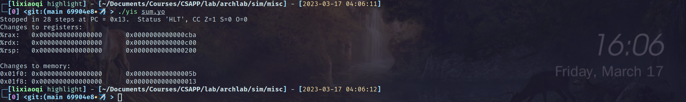
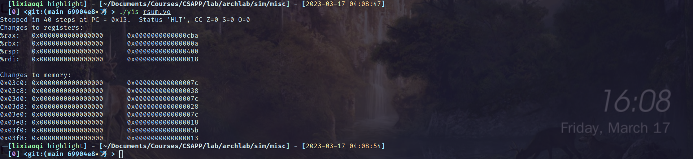
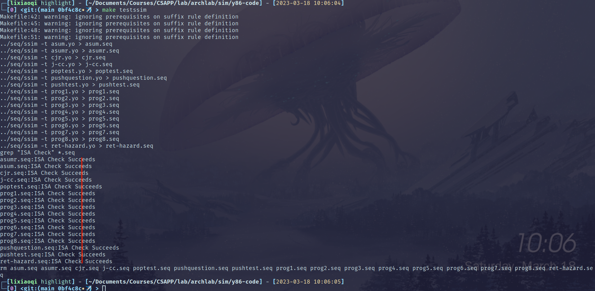
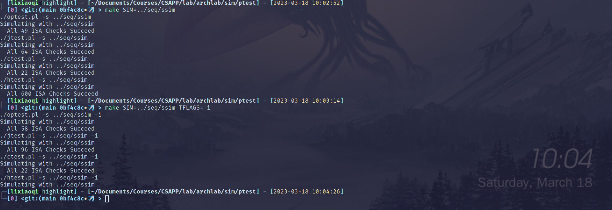
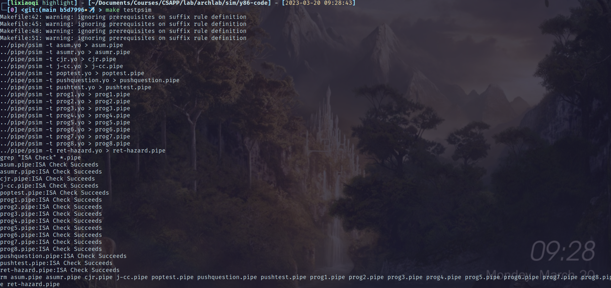
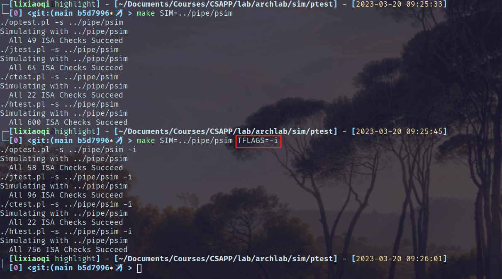

# archlab报告

> 誓死和这个实验斗争到底。

[TOC]

## 前言：何出此言？

为什么说斗争到底这句话呢？因为一看到这个实验的文档和框架，就大致觉得这不是个简单的实验，涉及到晦涩的汇编代码、编译相关的文法检查、cpu模拟器等等，想全部搞懂要花费不少精力。

要命的是，我拿到手的handout还有bug。比如刚拿到手编译Y86-64 tools，不成功，原因并不是网上说的缺少tk库等，我碰到的问题主要是源码中缺少的`extern`标志。经过几番查询，发现解决[方案](https://stackoverflow.com/questions/63152352/fail-to-compile-the-y86-simulatur-csapp)。

在需要的gcc的子文件夹，在makefile的flags中加入`-fcommon`。

此后回到sim文件夹，make成功。

关于图形界面：seq比较简单不需要，流水线版本调试还是需要GUI的。实验框架使用的tk库版本较老，为8.5版本，在最新的8.6版本中，有一个result域已经被弃用，还是要使用匹配版本的tk库。参考[文章](https://blog.csdn.net/qq_34665912/article/details/51232000)安装好tk8.5，再将头文件`<tk.h>`更改为`<tk8.5/tk.h>`，然后编译，出现`undefined reference to 'matherr'`问题，去`psim.c`中手动注释掉matherr的两行代码就好。至此环境配置结束。

## partA

### sum.ys

链表求和，仿照中文版教材(3e)第252页，配置内存、堆栈和主函数，再完成sum函数，源文件内容：

```
    .pos    0
    irmovq  stack, %rsp
    call    main
    halt
    .align  8
ele1:
    .quad   0x00a
    .quad   ele2
ele2:
    .quad   0x0b0
    .quad   ele3
ele3:
    .quad   0xc00
    .quad   0
main:
    irmovq  ele1, %rdi
    call    sum
    ret
sum:
    # init
    irmovq  $0, %rax
LH:
    andq    %rdi, %rdi
    je      E
    mrmovq  $0(%rdi), %rdx
    addq    %rdx, %rax
    mrmovq  $8(%rdi), %rdi
    jmp     LH
E: 
    ret
    .pos 0x200
stack:
```

结果：



返回值`%rax`是`0xcba`，正确。

### rsum.ys

类似上述，需要注意递归调用时寄存器的备份。

检查寄存器`%rax`的值，正确。

注意到，因为递归调用，所以堆栈变化比循环实现更多。



### copy.ys

需要实现数组拷贝、返回所有元素的异或。

目标数组正确赋值、返回结果正确。


## partB

这一部分要求加入指令iaddq，这条指令可以在习题4.3看到详细介绍。

添加指令，需要修改文件`sim/seq/seq-full.hcl`，主要是在每个阶段为iaddq指令选择合适的控制信号。

执行测试结果如下：

- 基准测试
  
  > You are simply making sure that your solution did not inject errors for the original instructions.
  
  

- 回归测试
  
  > - *make SIM=../seq/ssim*: test everything except iaddq. 
  > 
  > - *make SIM=../seq/ssim TFLAGS=-i*: To test your implementation of iaddq
  
  

## partC

这部分要求”软硬兼施“，既可以修改软件实现，又可以修改硬件实现，使得程序得到最大的性能提升，性能通过CPE衡量。

### 基础修改

在基准程序上修改如下：

- 将常量1外提出循环

- `mrmovq (%rdi), %r10`和`rmmovq %r10, (%rsi)`分离开，避免load/use冒险

- 循环测试len的部分，可以在修改`%rdx`后立刻使用jne判断，减少测试语句`andq %rdx %rdx`

这一步做完，平均CPE达到了10.84。

### 加入iaddq指令

因为iaddq指令并不涉及控制冒险等繁琐的点，所以修改逻辑和seq版本几乎相同

基准测试



扩展测试



### 使用iaddq指令进行改进

将加减常数的指令改成iaddq，CPE达到10.70，提升微弱是因为常数已经经过代码外提，每次只有循环外会额外用到两次(常数1和常数8)。

### 根据分支预测改进

因为处理器每次面对条件分支，都首先预测跳转地址，所以为了降低CPE，应该将分支跳转的地址写成常用的地址。

循环之前的判断：

```
    andq %rdx,%rdx        # len <= 0?
    jle  Done             # if so, goto Done:
Loop:
    ...
Done:
    ... 
```

这里分支跳转可以选择loop，减少预测错误：

```
    andq %rdx,%rdx        # len <= 0?
    jg   Loop            
    jmp  Done           # if so, goto Done:
Loop:
    ...
Done:
    ... 
```

此处修改使CPE降到10.55

### 循环展开

参考教材(3e)5.8节的循环展开技术。

类似如下叙述修改`ncopy.ys`，实现kx1展开：

```c
word_t ncopy(word_t *src, word_t *dst, word_t len)
{
    word_t count = 0;
    word_t val;

    len -= k
    while (len > 0) {
        val1 = src[0];
        // ...
        valk = src[k-1];

        dst[0] = val1;
        // ...
        dst[k-1] = valk;

        src += k, dst += k;    

        if (val1 > 0)
            count++;
        // ...
        if (valk > 0)
            count++;
    }
    len += k;
    if (len != 0)
        // 按照之前的逻辑遍历          
    return count;
}
```

采用7x1展开，平均CPE降到了8.04，然后尝试8x1展开，平均CPE为8.08。

观察发现，8x1性能有降低的主要原因是，在元素数量为7的倍数但不为8的倍数时，8x1性能较差(相较于7x1)，而显然7x1下，性能提高数量要多于8x1。由此考虑再按照8x1结束后再按照4x1展开，最终平均CPE降到了8。
