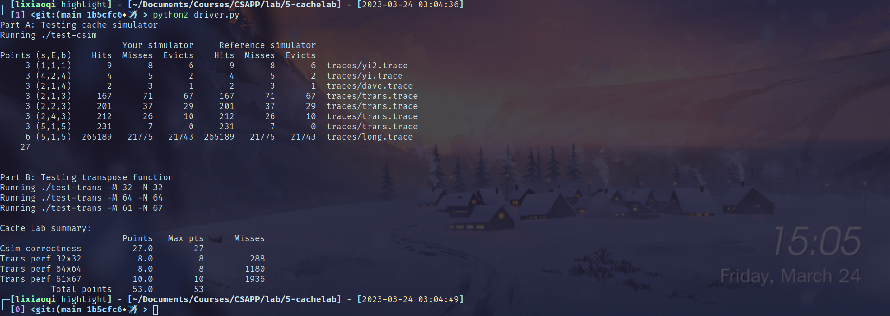
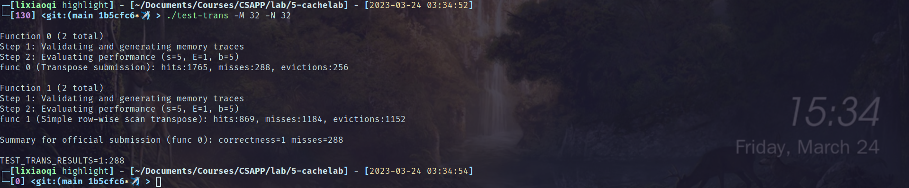
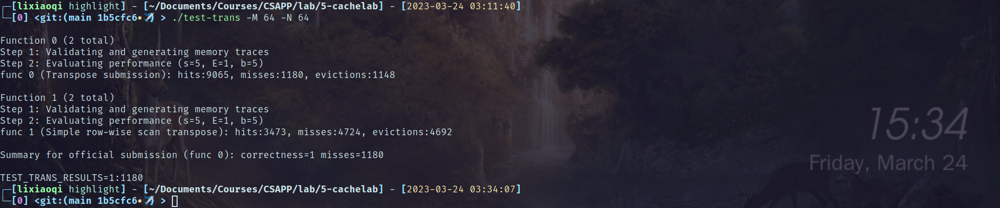

# cachelab报告

## 快览

## 细述

本次实验主要为了强化巩固缓存相关的知识，在part A要求实现一个简易的cache模拟器，part B要求提供矩阵转置代码，尽量减少缓存的miss.

### Part A

这个部分在了解缓存的概念和替换等策略后，是比较容易实现的。关于读出的tracefile中M标号该如何处理，在文档靠后`Working on Part B`中有给出。

个人写了比较多bug的地方在于：模拟LRU更新的逻辑。为了在行全有效却miss时evict一行，只需要保存最近的3个访问，但是不可以只选取最近的：

假设每组有4行，对于某一个组LRU保存有这样的flag访问序列：3，1，2（假设靠左表示更近访问），现在访问1，hit，然后需要更新。如果只选最近的3个，那么更新后结果是1，3，1，我们需要的是最近访问的3个不同的行/flag，这个结果显然不对，应该为1，3，2。

我的实现采用了长度为E-1的循环数组实现，初始内部存-1表示未初始化，然后根据每次访问，向数组追加本次访存的行号(idx)：

- 如果idx不在LRU保存的E-1个记录中，直接向后追加，对应指针后移

- 否则重新配置LRU：现在有E个记录，其中有两个重复，选出不重复的部分，同时保留原有的顺序

实现见`csim.c`的200行附近。

### Part B

这个部分需要给出矩阵转置的访存策略，尽量减少cache miss.

首先看**32x32**的矩阵情况，要求miss降低到300个以内。

因为给定的参数[s, E, b] = [5, 1, 5]，所以每行有32字节，8个int。访问矩阵中的某一个元素(i, j)，那么从(i, j)开始行序向右直到(i, j+7)8个元素都被存入缓存行中。为了减少miss，应该充分利用这些已经在缓存中的内容。

所以使用8x8分块，这时miss在330个。

然后发现其实矩阵A、B的相同元素都映射到同一行(index)相同，这样就会造成conflit miss。具体来说，假设按顺序(0, 0)...(0, 7)访问A，转置赋值给B的(0, 0)...(7, 0)，我们预期A的元素访问只发生一次miss，此后都在缓存中，但是不然，因为B的(0, 0)会映射到A(0, 0)的同一缓存行，导致A的元素被驱逐出。

为此，可以充分利用局部变量，将A的内容(一行)一次性读出，然后再赋值给B。

这样cache miss就降到了288

在看**64x64**的情况，要求miss降低到1300。

发现基本的8x8分块出现了很多miss，分析是因为相较32x32，A、B间冲突的频率被提高了：每四行就会出现冲突——2^s+b^=2^10^，包含2^8^个int，对应64x64矩阵的4行，试想8x8分块为第一行转置，A中的一行保存在临时变量中，经过B的1、5行时都会发生驱逐。

这里参考网上的思路，使用8x8内4x4的方法，这样做可以结合两种分块的优势：

- 8x8可以最大化缓存行的利用率，但是直接写B会造成较多冲突

- 4x4可以减少冲突，但是一个缓存行里的另外4个int都被浪费

所以使用8x8的方式处理，减少浪费，使用4x4的方式分配，减少冲突。

如此，miss可以将低到1180。

最后看**61x67**的情况，要求miss降到2000以下。

因为按照朴素16x16块的写法，miss就已经达到2009，为满足要求只需再加入临时变量的使用即可。最终miss达到了1936。

