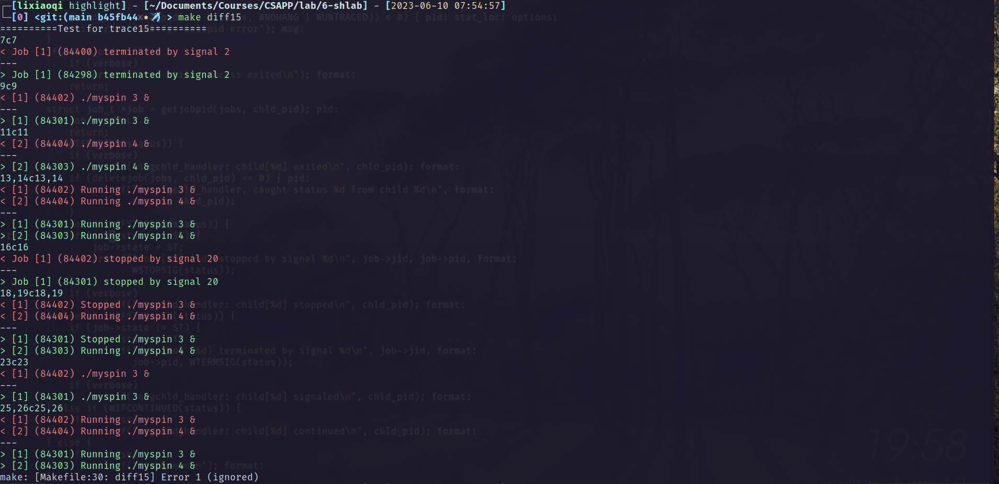
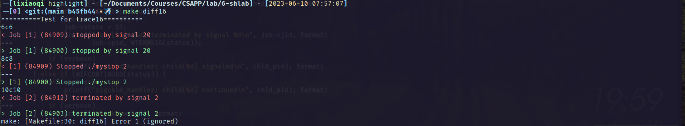

# shell lab报告

## 快览

这个实验官方没有给出详尽的测试，需要自己对比标准程序输出的结果，由于进程的pid是不定量，所以比较时会不可避免出现差异，此外结果应该完全一样。

对Makefile增加目标规则如下：

```makefile
TESTCASES = $(shell seq -f 'diff%02g' 01 16)
diff%: $(FILES)
	@echo "==========Test for trace$*=========="
	@$(DRIVER) -t trace$*.txt -s $(TSHREF) -a $(TSHARGS) > trace$*_ref.out
	@$(DRIVER) -t trace$*.txt -s $(TSH) -a $(TSHARGS) > trace$*_tsh.out
	-@ colordiff trace$*_tsh.out trace$*_ref.out
	
check_all: $(TESTCASES)
```

使用`make check_all`可以比较全部16个样例。使用`make diffxx`可以比较单个样例。在此只附上最后两个样例：





可见只有进程的pid不同。

## 详解

这个实验的核心是unix下进程之间传递信号，不需要实现管道、重定向。

### 1、信号传递

我的实现中：

- 来自终端的SIGINT由`sigint_handler`传递，使前台任务终止

- SIGTSTP由`sigtstp_handler`传递，使前台任务暂停

- SIGCONT由`do_bgfg`传递，使暂停的任务继续

这里还牵扯到进程组的概念，传递信号需要使用`Killpg`来向整个进程组发送信号。

以上只是进程间的信号传递，shell程序还需要维护内部的joblist，这是由`sigchld_handler`处理的，当信号发送给子程序后，OS会改变子程序的执行状态，同时给我们的shell程序传递SIGCHLD信号，使用`waitpid`来获取子进程的状态，我们就可以在`sigchld_handler`中统一地维护joblist。

一个例外是任务在前台后台之间的切换，bg和fg都传递了SIGCONT信号，但是切换的status、输出都不相同，所以SIGCONT的输出和status维护都在`do_bgfg`里执行。

### 2、等待子进程

shell程序会`fork`子进程来执行用户所需命令，shell程序注册了`sigchld_handler`来接受子进程的信号，同时`waitfg`函数语义上也会阻塞等待子进程的执行，如果两个函数都调用`waitpid`，在子程序退出时，信号只能被一个函数捕捉到，另一个就会报错。

在这里参考了实验文档的做法，`waitfg`只是做忙等，其只判断等待的进程目前是否在前台执行：

```cpp
void waitfg(pid_t pid)
{
    while (pid == fgpid(jobs))
        sleep(0);
    return;
}
```

当前台的进程中断、退出时，`sigchld_handler`会修改job的status，使`fgpid`返回其他值，进而`waitfg`跳出循环。

> 文档也有提到可以两个函数都使用`waitpid`实现，猜测是一个捕捉到信号后，再重新发送一遍信号？

### 3、其余的细节

这个实验细节丰富，比如：

- 子进程的进程组需要和shell进程区分开，这里使用`setpgrp()`实现

- 为了防止父进程在`addjob`完成之前就错过了子进程的退出信号，需要调用`sigprocmask`来阻塞SIGCHLD信号，然后又要分别在父进程和子进程中unblock这个信号

- 任务执行完要调用`deletjob`而不是`clearjob`，因为前者会额外设置`nextjid`

总而言之，这个实验的工作量并不大，但是如果没有充分理解执行流程，会很难取得进展，所以算是收获颇丰！
