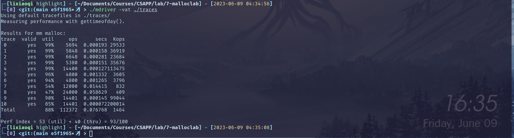
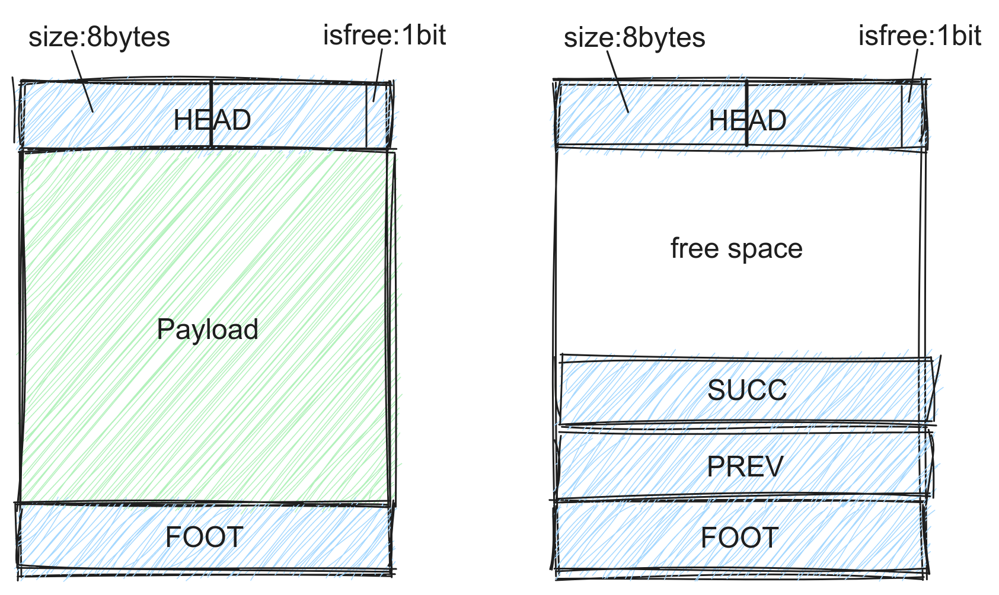
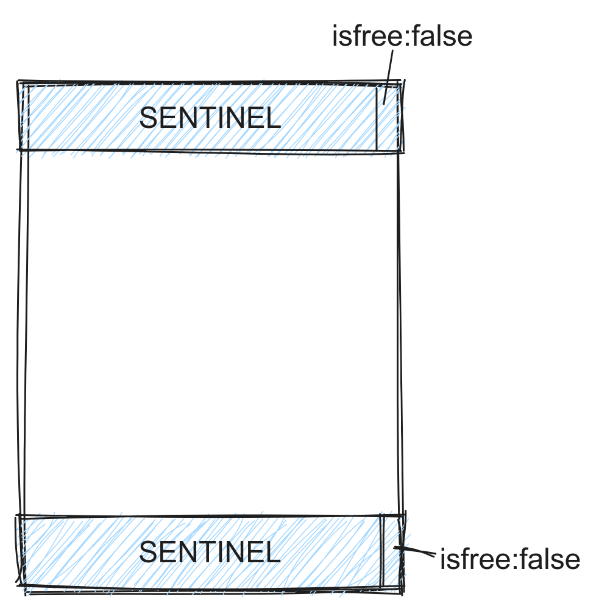
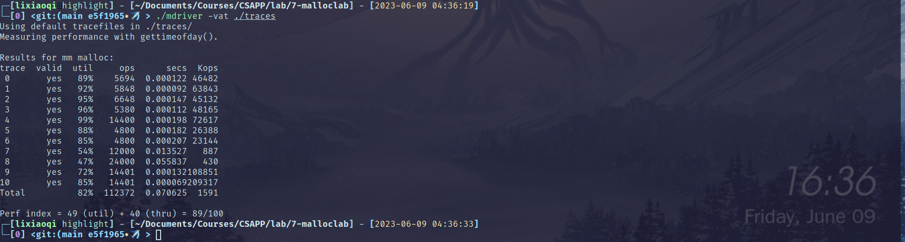

# malloclab报告

## 快览



本次实验，使用显式双向链表实现对内存分配器进行改进，使用bestfit策略选取空闲块，最终实验评分为93。

## 详解

### 1、设计

这个实验在去年的操作系统课上有做过，那时的实现也是显式双向链表，内存块的逻辑组织如下：


审视一下之前的框架和自己的实现，觉得逻辑不是很清晰，同时头部/尾部保存相邻块的信息是冗余的，所以重新搓了一个更简洁的版本。

设计每个块都具有头部、尾部，其中保存块大小信息和当前块的free状态，在空闲块中，还会保存pred和succ的空闲链表信息，如下：



在堆底和堆顶分别保存哨兵边界，来简化判断的逻辑：



### 2、实现

`mm_malloc`和`mm_free`的实现主要是正确性，容易出错的地方，就是指针偏移`ptr+off`：

- `ptr`为`void*`或`char*`时，结果偏移off

- `ptr`为自定义数据类型`struct Border*`时，结果偏移`off * sizeof(struct Border)`

这个问题我出现了两次，所以特地提一下。

> You are not allowed to define any global or static compound data structures such as arrays, structs, trees, or lists in your mm.c program

关于自定义数据类型，虽然实验文档不允许，但是个人认为可以接受，主要是简化实现（为考试周复习节省时间）：

```cpp
typedef struct Border {
    size_t size;
    /* @bit0: if this block is free
     */
    unsigned char info;

} Head, Foot;
```

`mm_realloc`的实现也是简单的，但是为了得到好的分数，不能使用naive的版本，naive的版本在最后两个针对`mm_realloc`的测试中，只能得到30%左右的利用率，我的实现中使用了如下的判断逻辑：

- 扩容时，将当前内存块视作空闲块，和邻居块做合并(递归)，这主要是复用`coalesce`函数。然后根据`coalesce`返回的指针是否与原指针相同，来判断是否进行内存搬移，这里需要注意，内存搬移时可能存在overlap，需要使用`mememove`函数而不是`memcpy`。如此可以返回结果指针。

- 如果不是扩容，就直接返回原指针。

这里有面向测试样例的取巧，因为我发现后两个测试主要都是一点点递增的`realloc`，测试的核心在于一个块的逐渐扩容，似乎并没有关于内存碎片的测试逻辑，所以这里并没有保留缩减内存空间的逻辑，而是直接返回。

实际的内存分配器一定是要缩减内存空间的(当用户调用`realloc`缩容时)，我这里没有保留相关逻辑，但是可以方便地调用`cut`函数实现：

```cpp
// cut an old block(ptr) to 2 blocks,
// - block1 with new_size, return its ptr
// - block2 with size >=MIN_PAYLOAD_SIZE, maintain the logic
void cut(void* ptr, size_t new_size)
{
    size_t ori_size = get_size(ptr);
    // required block
    set_size(ptr, new_size);
    set_used(ptr);
    // no need to modify the list link for ptr

    // deal with new free block
    void* cut_ptr = ptr + new_size + 2 * BORDER_SIZE;
    set_size(cut_ptr, ori_size - new_size - 2 * BORDER_SIZE);
    set_free(cut_ptr);
    cut_ptr = coalesce(cut_ptr);
    add_to_free_list(cut_ptr);
}
```

### 3、空闲块策略

这里实现了两种最简单的搜索空闲块的策略：first fit和best fit

best fit需要搜寻整条链表，返回最接近所需尺寸的内存块，而first fit只返回第一眼看到的足够容纳的内存块，二者的选择在于速度和效果的平衡，在这个实验中，对于时间效率的约束并不是很强，所以best fit并没有带来thru的下降。

frist fit只有89分：



best fit达到了93分：


### 4、Better？

测试样例基本都达到了很高的内存利用率，但是样例7、8除外。本质还是内存碎片的存在，为了优化这个，猜测可以这样优化：在细碎的空闲块达到一定阈值后，执行一次全局的内存块对齐，将细碎的空闲块移动到一起进行合并。
