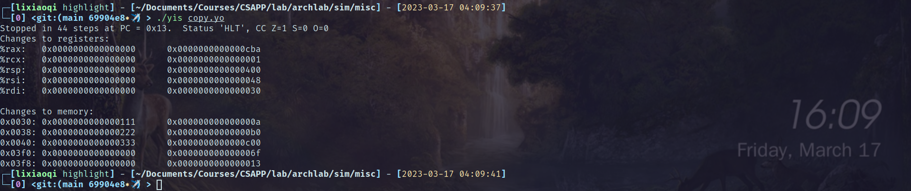

# archlab报告

> 誓死和这个实验斗争到底。

## 前言：何出此言？

为什么说斗争到底这句话呢？因为一看到这个实验的文档和框架，就大致觉得这不是个简单的实验，涉及到晦涩的汇编代码、编译相关的文法检查、cpu模拟器等等，想全部搞懂要花费不少精力。

要命的是，我拿到手的handout还有bug。比如刚拿到手编译Y86-64 tools，不成功，原因并不是网上说的缺少tk库等，我碰到的问题主要是源码中缺少的`extern`标志。经过几番查询，发现解决[方案](https://stackoverflow.com/questions/63152352/fail-to-compile-the-y86-simulatur-csapp)。

在需要的gcc的子文件夹，在makefile的flags中加入`-fcommon`。

此后回到sim文件夹，make成功。

## partA

### sum.ys

链表求和，仿照中文版教材(3e)第252页，配置内存、堆栈和主函数，再完成sum函数，源文件内容：

```
    .pos    0
    irmovq  stack, %rsp
    call    main
    halt
    .align  8
ele1:
    .quad   0x00a
    .quad   ele2
ele2:
    .quad   0x0b0
    .quad   ele3
ele3:
    .quad   0xc00
    .quad   0
main:
    irmovq  ele1, %rdi
    call    sum
    ret
sum:
    # init
    irmovq  $0, %rax
LH:
    andq    %rdi, %rdi
    je      E
    mrmovq  $0(%rdi), %rdx
    addq    %rdx, %rax
    mrmovq  $8(%rdi), %rdi
    jmp     LH
E: 
    ret
    .pos 0x200
stack:
```

结果：


返回值`%rax`是`0xcba`，正确。

### rsum.ys

类似上述，需要注意递归调用时寄存器的备份。

检查寄存器`%rax`的值，正确。

注意到，因为递归调用，所以堆栈变化比循环实现更多。


### copy.ys

需要实现数组拷贝、返回所有元素的异或。

目标数组正确赋值、返回结果正确。



## partB

这一部分要求加入指令iaddq，这条指令可以在习题4.3看到详细介绍。

添加指令，需要修改文件`sim/seq/seq-full.hcl`，主要是在每个阶段为iaddq指令选择合适的控制信号。

执行测试结果如下：

- 基准测试
  
  > You are simply making sure that your solution did not inject errors for the original instructions.
  
  

- 回归测试
  
  > - *make SIM=../seq/ssim*: test everything except iaddq. 
  > 
  > - *make SIM=../seq/ssim TFLAGS=-i*: To test your implementation of iaddq
  
  
