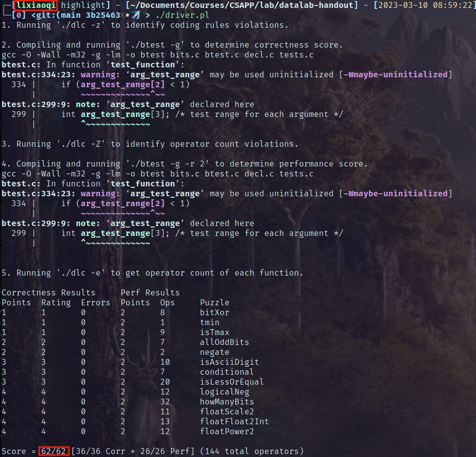

# datalab报告

## 快览

本实验要求使用限定操作符，在限定数量内完成若干操作。

实验完成截图如下：



## 具体实现阐述

#### bitXor

$$
A\oplus B=\overline{(\overline{A\overline B})(\overline{\overline AB})}
$$

```c
int bitXor(int x, int y) {
    int n_x = ~x;
    int n_y = ~y;
    int case1 = ~(x & n_y);
    int case2 = ~(n_x & y);
    return ~(case1 & case2);
}
```

#### tmin

tmin = 100...0

```c
int tmin(void) {
    return 1 << 31;
}
```

#### isTmax

Tmax = 011...1，满足\~(x+1)=x

同时11...1也满足上述等式，特判一下

```c
int isTmax(int x) {
    int still_x = ~(x+1);
    int not_ffff = !!(x^(~0));
    return not_ffff & !(still_x ^ x);
}
```

#### allOddBits

按二分的方式将原32位数据按位与，合并两次，得到8位的结果。

如果是allOddBits的情况，提取这八位中的奇数位，就应该是0xAA.

```c
int allOddBits(int x)
{
    int cmp_16 = (x >> 16) & x;
    int cmp_8 = (cmp_16 >> 8) & cmp_16;
    int cmp = (cmp_8 & 0xAA) ^ 0xAA;
    return !cmp;
}
```

#### negate

二进制补码，取相反数，就是取反加一

```c
int negate(int x) {
  return ~x + 1;
}
```

#### isAsciiDigit

对于高28位，应该是00...011

对于低4位，应该小于等于9

```c
int isAsciiDigit(int x) {
    int h_flag = !((x>>4) ^ 0x3);
    int l = x & 0xF;
    int sub = 0x9 + (~l + 1);
    int l_flag = !(sub >> 4);
    return h_flag & l_flag;
}
```

#### conditional

| x    | !x  | ((!x) << 31) >> 31 |
| ---- | --- | ------------------ |
| 0    | 1   | 0xFF...FF          |
| else | 0   | 0                  |

```c
int conditional(int x, int y, int z) {
    int magic = ((!x) << 31) >> 31;
    int y_ = ~magic & y;
    int z_ = magic & z;
    return y_ | z_;
}
```

#### isLessOrEqual

根据正负和除去符号位的大小关系(flag)判断，具体如下：

- 一正一负：x负y正时返回1

- 同号：除去符号位的部分，比较结果是小于等于时返回1

```c
int isLessOrEqual(int x, int y) {
    int pos_x = !(x >> 31);
    int pos_y = !(y >> 31);
    int mask = 1 << 31;
    int x_ = x ^ mask;
    int y_ = y ^ mask;
    int sub = y_ + (~x_ + 1);
    int flag = !(sub >> 31);
    return (!pos_x) & pos_y | flag & ((pos_x & pos_y) | !(pos_x | pos_y)) ;
}
```

#### logicalNeg

利用二分归约，即两部分做按位与，保留出现的1，直至最低位。

取最低位的取反作返回值。

```c
int logicalNeg(int x) {
    int x_16 = (x >> 16) | x;
    int x_8 = (x_16 >> 8) | x_16;
    int x_4 = (x_8 >> 4) | x_8;
    int x_2 = (x_4 >> 2) | x_4;
    int x_1 = (x_2 >> 1) | x_2;
    int flag = (~x_1) & 0x1;
    return flag;
}
```

#### howManyBits

- 正数需要0做符号位，bits=最高位1所在位置+1

- 负数1做符号位，bits=高位连续1的最低一位所在位置

- 负数取反后的判断和正数逻辑完全相同

采用二分的思想对正数进行判断：

依次检查16位、8位、4位、2位、1位。

在检查16位时，首先检查高16位(x>>16)：

- 如果非0x0000，接下来检查**高**16位中的高8位，bits至少为16+1

- 高16位为0时，接下来检查**低**16位中的高8位，bits至少为0+1

如此循环，直至检查位数的数量是1时结束。


#### floatScale2

[单精度浮点数](https://en.wikipedia.org/wiki/Single-precision_floating-point_format#Exponent_encoding)

- 指数为0时，给小数部分乘2
  
  小数溢出时刚好补到指数最低位，不需要作特判

- 指数位0xFF时，返回原值

- 其他情况，只需将指数部分加1

```c
unsigned floatScale2(unsigned uf)
{
    unsigned E_ = (uf & 0x7F800000) >> 23;
    unsigned F = uf & 0x007FFFFF;

    if (E_ == 0x00)
        F <<= 1;
    else if (E_ == 0xFF)
        ;
    else
        E_ += 1;

    return (uf & 0x80000000) | (E_ << 23) | F;
}
```

#### floatFloat2Int

最重要的是指数位，指数小于0时，直接返回0，而32位最终能表示的正整数，最高位至多在第30位，由此判断是否出现out of range。

合理的情况下，逻辑上1.frag左移exp位，再配合S标志位取负值。

```c
int floatFloat2Int(unsigned uf)
{
    int S   = uf & 0x80000000;
    int Exp = ((uf & 0x7F800000) >> 23) - 127;
    int F   = uf & 0x007FFFFF;
    int body;
    if (Exp < 0)
        return 0;
    else if (Exp > 30)
        return 0x80000000u;

    body = F >> (23 - Exp);
    body |= 1 << Exp;

    if (S)
        body = ~body + 1;

    return body;
}
```

#### floatPower2

根据单精度浮点数的表示，

- 常规的-126 <= x && x <= 127情况，只需要调整指数部分

- 更大的无法表示

- 更小的还可以denorm的形式表示
  
  denorm的范围是2^-127^\~2^-149^，denorm的指数部分为0，小数部分只需要在特定位置1即可

- 比denorm还小的就无法表示

```c
unsigned floatPower2(int x)
{
    if (-126 <= x && x <= 127)
        return (x + 127) << 23;
    else if (x > 0)
        return 0xFF << 23;
    else if (x >= -149) {
        return 1 << (x + 149);
    } else
        return 0;
}
```
